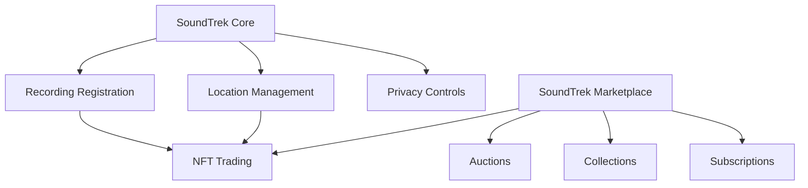

# SoundTrek Audio Diary

A decentralized platform for creating, sharing, and discovering location-based audio experiences on the Stacks blockchain.

## Overview

SoundTrek enables users to create and share audio diaries and soundscapes tied to specific geographic locations. Content creators can record audio, associate it with GPS coordinates, and optionally mint their recordings as collectible NFTs. The platform creates an immersive experience where users can discover hidden soundscapes while exploring physical locations.

### Key Features
- Location-based audio content creation and discovery
- NFT minting and trading of audio recordings
- Geographic indexing for content discovery
- Privacy controls for location data
- Creator monetization through NFT sales and tips
- Collection-based content organization
- Subscription model for premium content

## Architecture

The platform consists of two main smart contracts that work together to provide the core functionality:



### Core Components
- **SoundTrek Core**: Manages audio recordings, location data, and content ownership
- **SoundTrek Marketplace**: Handles NFT trading, auctions, and monetization features

## Contract Documentation

### SoundTrek Core (`soundtrek-core.clar`)

Primary contract for managing audio recordings and their associated metadata.

#### Key Functions
- `register-recording`: Create new audio recordings with location data
- `update-recording-metadata`: Modify existing recording details
- `update-privacy`: Adjust location privacy settings
- `transfer-ownership`: Transfer recording ownership
- `get-recordings-by-location`: Discover content by geographic location

### SoundTrek Marketplace (`soundtrek-marketplace.clar`)

Handles all marketplace functionality for trading and monetizing recordings.

#### Key Functions
- `list-nft`: List recordings for sale
- `create-auction`: Start an auction for a recording
- `create-collection`: Group recordings into collections
- `subscribe-to-collection`: Subscribe to creator collections
- `tip-creator`: Send tips to content creators

## Getting Started

### Prerequisites
- Clarinet
- Stacks wallet
- Audio content (IPFS compatible)

### Installation

1. Clone the repository
2. Install dependencies
```bash
clarinet install
```

3. Test the contracts
```bash
clarinet test
```

## Function Reference

### Core Recording Management
```clarity
(define-public (register-recording 
  (recording-id (buff 36))
  (title (string-utf8 100))
  (description (string-utf8 500))
  (ipfs-hash (string-ascii 64))
  (latitude int)
  (longitude int)
  (privacy-radius uint)
  (tags (list 10 (string-utf8 30)))
)
```

### Marketplace Operations
```clarity
(define-public (list-nft (nft-id uint) (price uint) (royalty-percent uint))
(define-public (buy-nft (nft-id uint))
(define-public (create-auction (nft-id uint) (reserve-price uint) (duration-blocks uint) (royalty-percent uint))
```

## Development

### Testing
Run the test suite:
```bash
clarinet test
```

### Local Development
1. Start Clarinet console:
```bash
clarinet console
```

2. Deploy contracts:
```bash
clarinet deploy
```

## Security Considerations

### Privacy
- Location data is protected by adjustable privacy radius
- Private recordings cannot be discovered without explicit permission
- Locked recordings cannot be modified after finalization

### Financial
- Maximum royalty percentages are enforced
- Minimum pricing requirements prevent spam listings
- Auction mechanisms include safeguards against invalid bids
- Marketplace fees and royalties are automatically distributed

### Access Control
- Only recording owners can modify metadata
- Transfer operations require ownership verification
- Collection management restricted to creators
- Contract owner privileges are limited and documented